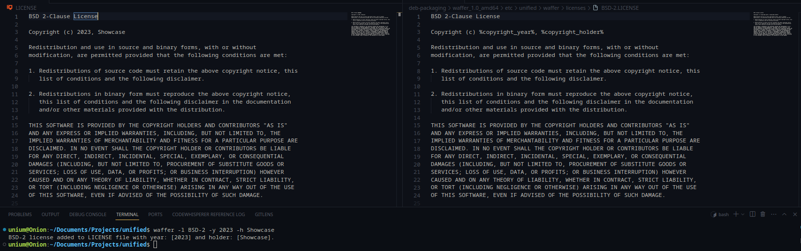

# Waffer
An easy to use CLI tool that adds license(s) to your projects!
Inpired by [captainsafia/legit](https://github.com/captainsafia/legit) :)
| Options    | Output                                    |
| ---------- | ----------------------------------------- |
| -h         | Displays the help menu                    |
| -v         | Displays the version of waffer            |
| -l         | License                                   |
| -y         | Copyright year                            |
| -h         | Copyright holder                          |



# How to install
## Debian
You can find the latest [debian binary over here](https://github.com/unifiedorg/waffer/releases/latest), and install it by running
```
sudo dpkg -i waffer-1.0-amd64.deb
```

## Manually building
You can manually build by :

**1st) Installing GCC**
```
sudo apt-get update
sudo apt-get install build-essential
```

**2nd) Building the waffer.c file**
```
gcc -o waffer ./src/waffer.c
```

**3rd) Moving the waffer executable to bin**
```
sudo mv ./waffer /usr/local/bin/waffer
```

**4th) Add licenses to /etc/**
```
sudo mkdir /etc/unified/ /etc/unified/waffer/ && sudo mv ./src/licenses/ /etc/unified/waffer/licenses/
```

# Contributing
Want to contribute? Check out [CONTRIBUTING.md](./CONTRIBUTING.md)

# Contributers
Maintainer & Creator - TheUnium
